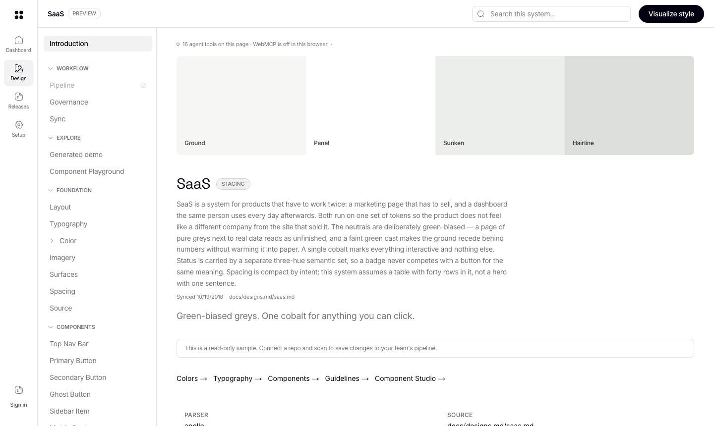
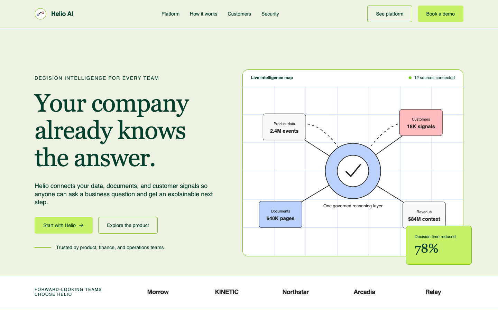
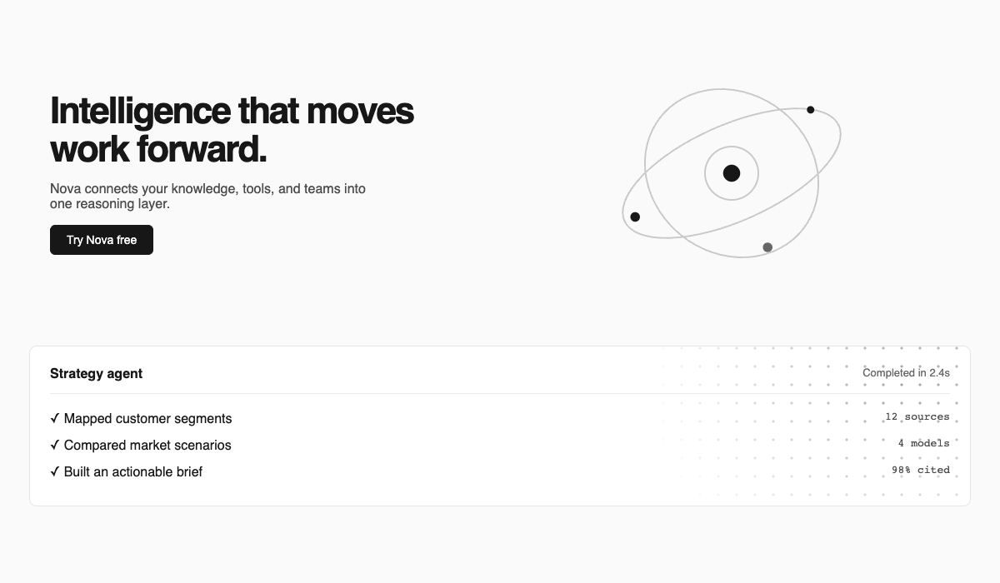

# BlockSmith

**Turn any website's design into rules your coding agent must follow. When the agent breaks a rule, BlockSmith says no, quotes the rule, and hands it the fix.**

<p align="center">
  
  
  
  <a href="https://github.com/Desmosy/blocksmithv1/actions/workflows/protocol-conformance.yml"></a>
  
</p>

<p align="center">
  
  
  
</p>

You know how big tech companies have a whole floor of designers guarding a design system, which is why their buttons never come out weird? Guess what: now you have that too. (womp womp..) Name a site you like, stripe, cohere, openai whatever and BlockSmith reads its colors, type, and spacing off the live page and hands you a governed design system with its own wiki. Total headcount: 0, NADA.

Already have a design system because you work on one of those fancy teams? Even better. Bring it in, and BlockSmith becomes the strict design reviewer who never sleeps, never blinks, and never approves a random purple. Your agent asks before it builds, gets rejected when it freelances, and fixes its own work while you watch.

Built for the **WebMCP Challenge**. The whole governance engine lives on the page as [WebMCP](https://github.com/webmachinelearning/webmcp) tools, so you and the agent in your browser are looking at the same rules at the same time. It reads your system, builds against it, and gets corrected the moment it drifts.

**Live app:** <https://blocksmithv1.vercel.app>

**All tools and schemas:** [`/.well-known/webmcp.json`](https://blocksmithv1.vercel.app/.well-known/webmcp.json) · **How it works:** [`/protocol/webmcp`](https://blocksmithv1.vercel.app/protocol/webmcp) · **License:** [AGPL-3.0](./LICENSE)

---

## How to use BlockSmith

### 1. With ChatGPT (easiest, nothing to install)

The ChatGPT desktop app has a built-in browser that supports WebMCP out of the box.

1. Open the ChatGPT desktop app.
2. Ask it to open `https://blocksmithv1.vercel.app/dashboard` in its browser.
3. Talk to it in plain words. Some things to try, in order:

```
Capture the design system from cohere.com
```
ChatGPT calls BlockSmith's capture tool. BlockSmith reads the live site, pulls out its colors, type, spacing and components, and saves it as a design system with its own wiki.

```
Open the wiki for the system you just captured
```
You get a full design-system site: tokens, components, do's and don'ts, and a guide written for agents.

```
Build me a landing page for a marketing company using this design system's rules. Use SVG for any decorative graphics.
```
ChatGPT writes the page, runs it through `check_governance`, fixes what gets rejected, and shows you the result rendered in the system's own tokens. You can open it full page, view the code, or download the HTML.

```
Can you build a launch banner using #7c3aed and show it to me on the page or not?
```
If that purple is not in the system, the agent gets told no, with the rule quoted and the closest allowed color suggested. That is the whole point.

### What it looks like

The wiki BlockSmith builds from a captured or written design system:



A landing page an agent generated against a captured design system, checked and corrected by governance. Every color, face, and radius on it comes from the captured tokens:



Decorative graphics come out as quiet, token-driven SVG instead of clip art, because the rules say so:



### 2. With Chrome

1. Go to `chrome://flags/#enable-webmcp-testing`, enable it, restart Chrome. You need Chrome 149 or later.
2. Open <https://blocksmithv1.vercel.app/wiki?doc=saas.md>.
3. The page registers its tools automatically. Open DevTools, then **Application**, then **WebMCP** to see them and call them by hand, or let your agent use them.

No sign-in is needed to read a system, check code, or capture a site.

### 3. Run it on your machine

```bash
npm install
npm run dev
```

Open <http://localhost:3000>. Everything works without credentials. Supabase and model keys are only needed for accounts and live capture. Copy `.env.example` to `.env.local` if you want those.

One note on capture: reading a rendered page needs a Chromium. On your machine BlockSmith finds one automatically. On a serverless host, point it at any remote browser that speaks CDP:

```bash
BLOCKSMITH_BROWSER_WS=wss://your-browser-host/?token=...
```

Without it, capture falls back to reading the site's CSS. You get a thinner result, and the tool tells you which kind you got.

### 4. In your editor

The rules can follow you out of the browser:

- **Export a skill.** Ask the agent to `export_skill`, or download it from the wiki. Your coding agent in Cursor or Claude Code then writes compliant code from the start.
- **Remote MCP.** Run `npm run mcp`, or point an MCP client at `/api/mcp`. Same tools, same registry.
- **Two-way sync.** Save a file in `docs/designs.md/` and the wiki refreshes. Edit in the wiki and hit **Finalize**, and it writes back to the markdown.

---

## Why this is a WebMCP use case

Most agent apps give the agent more power: search this, buy that. BlockSmith gives it **boundaries**.

An agent editing UI has no way to know your locked tokens, your frozen components, or your team's rules. So it guesses. The guess looks fine, ships, and someone catches it in review three days later. Or nobody does.

With WebMCP, the page itself hands the agent the rules as tools it can call. `check_governance` does not just say invalid. It returns the exact rule broken and the compliant value to use instead, so the agent fixes its own work in the same turn while you watch the page update.

That is the new thing here: the human and the agent working on the same live design system, with the site as the referee.

## What people and agents do together

| You | The agent |
|---|---|
| Open your design system in the wiki | Reads the screen with `get_current_context` |
| Ask for a component | Calls `get_governance_rules` before writing a line |
| Paste code into Governance | `check_governance` returns the verdict inline |
| See `REJECTED` with the rule quoted | Calls `fix_violations` and corrects itself |
| Switch design systems | Its tool schemas re-register and `toolchange` fires |
| Name a site you like | Calls `capture_site_design` and saves it as a system |
| Leave for your editor | Calls `export_skill` so the rules follow you |

Every tool call the agent makes is listed on the page, so you always see what it did.

## How WebMCP is implemented

Tools register against `document.modelContext` from one shared registry, so the in-page tools and the remote MCP server (`/api/mcp`, Streamable HTTP) can never drift apart.

```js
document.modelContext.registerTool({
  name: "check_governance",
  description:
    "Check UI code against the active design system. Returns each violation with the rule it breaks and the compliant token to use instead.",
  inputSchema: {
    type: "object",
    properties: {
      code: { type: "string", description: "The component source to check" },
      component: { type: "string", description: 'Component name, e.g. "Button"' },
    },
    required: ["code"],
  },
  annotations: { readOnlyHint: true },
  execute: async ({ code, component }) => {
    const res = await fetch("/api/webmcp/invoke", {
      method: "POST",
      headers: { "content-type": "application/json" },
      body: JSON.stringify({ tool: "check_governance", args: { code, component } }),
    });
    const { text } = await res.json();
    return { content: [{ type: "text", text }] };
  },
}, { signal: controller.signal });
```

Registration is tied to the page lifecycle: `useWebMcp()` registers on mount and aborts on unmount, so tools appear and disappear with the page they belong to.

### Design decisions worth knowing

- **Tool output stays under 1,500 characters.** Chrome enforces this. A `design.md` is far bigger, so tools return a summary plus a link, never the whole document.
- **`untrustedContentHint` on `capture_site_design`.** That tool returns content from an arbitrary third-party URL, a classic prompt-injection vector. The annotation tells the agent to treat it as data, not instructions.
- **`readOnlyHint` split.** Every `get_*` and `check_*` tool is marked read-only, so the agent knows which actions need confirmation.
- **Composition is checked, not just values.** Two primary buttons in one view, a card nested in itself, a missing required label. Rules about arrangement that a value linter cannot see.
- **Every violation carries a stable rule id** like `off-token-color` or `banned-gradient`, so it can be cited and tracked.
- **The tool surface is live.** `check_component` carries an enum of the active system's components. Switch systems and the tools re-register with new schemas, so the agent cannot name a component the current system does not have.
- **Auto-fix stops where judgement starts.** `fix_violations` applies every mechanical repair and returns what it refused to touch, like a color with no close token, because picking one is a design decision.
- **Discovery is generated, not written.** `/.well-known/webmcp.json` is built from the registry at request time.

---

## Project structure

```
src/
├── app/wiki/            # the design system UI, where the tools register
├── components/wiki/     # shell, governance panel, component playground
├── lib/webmcp/          # shared tool registry, one source of truth
│   └── dev-polyfill.ts  # spec-shaped stub for testing without the flag
├── hooks/useWebMcp.ts   # registration lifecycle
├── app/api/webmcp/      # server dispatch
├── lib/governance/      # color, scale, Tailwind, rule and capability checks
│   └── autofix.ts       # applies what is mechanical, refuses what is not
├── lib/ingest/          # capture a public site's design
├── lib/mcp/             # remote MCP server (Streamable HTTP)
└── mcp/handlers.ts      # implementations, transport-agnostic
docs/designs.md/         # bundled design systems, as markdown
evals/                   # tool-selection evals
packages/                # @blocksmith CLI, SDK, protocol
```

## Verify

```bash
npm run verify:webmcp   # budgets, per-preset governance, auto-fix safety
npm run typecheck
npm run build
```

## License

[AGPL-3.0-only](./LICENSE). Use it, self-host it, build on it. If you modify it and offer it to others, including as a hosted service, you must share your modified source under the same license. See [LICENSING.md](./LICENSING.md).

The BlockSmith name and logo are not part of the license grant.
