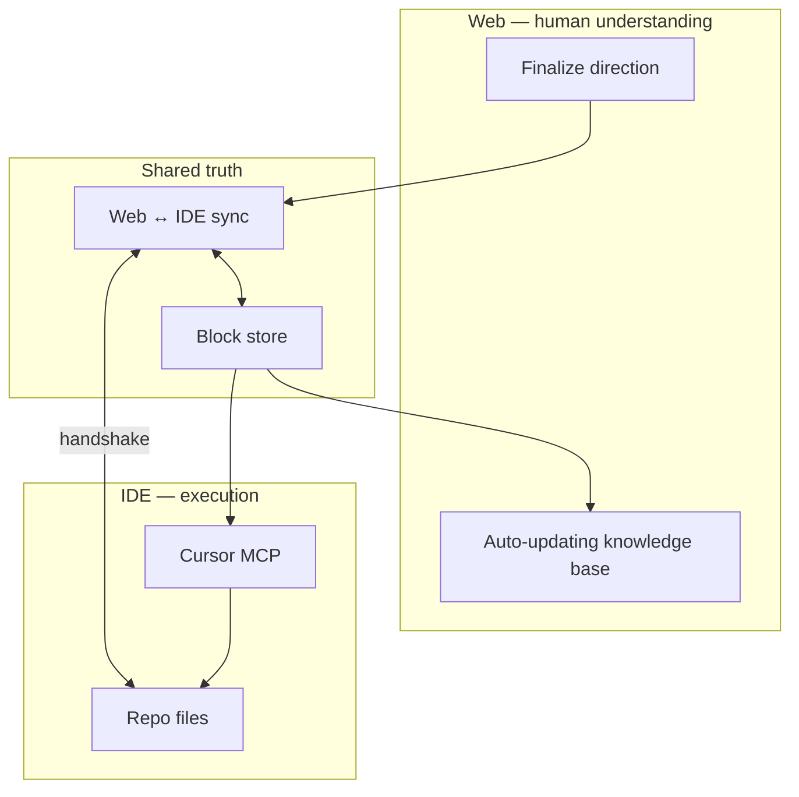

# Thesis — Why BlockSmith & the UI AI Lab Exist

This is the north star. Every experiment, spec, and sprint should trace back here.

**Plain-language pitch:** [PITCH-AND-PRODUCT-MODEL.md](./PITCH-AND-PRODUCT-MODEL.md)

---

## Current focus (2026) — software first

**Ship one correct software loop before hardware or new languages.**

| Phase | Goal | Status |
|-------|------|--------|
| **1 — Software truth** | Scan vendor repo → `.md` → visual wiki → MCP governance. Verifiable (`npm run verify:software`). | **Now** |
| **2 — Design as library** | `.md` → `@blocksmith/<project>` — `Surface`, `Text`, `Button`; AI imports tokens, does not write CSS. | **v0 local** ([PHASE2-PULSE.md](./PHASE2-PULSE.md)) |
| **3 — Device profiles** | Same IR → watch/HMI simulator → native/LVGL; same **contract**, not same JS `import` on chip. | Planned |

**Paused until phase 1 is solid in the wild:** ingest-everything, social screenshots, Quartus/FPGA, public block feedback at scale.

**One sentence for today:** Connect a real repo, get a wiki humans can browse and agents can govern—not a markdown dump.

Handoff checklist: [.cursor/build-status.md](../.cursor/build-status.md)

---

## The shift

Product teams are accumulating **agent-oriented design documentation** faster than ever:

- `CLAUDE.md`, `AGENTS.md`, `DESIGN.md`, `design.md`
- Component rules, token dumps, workflow notes, Figma exports pasted into markdown
- Repo-local instructions tuned for Cursor, Claude Code, and MCP

This is good. Agents need structured context to stop hallucinating UI.

**The bet:** These files will **keep growing**—more rules, more edge cases, more “when building X, do Y.” Teams will treat markdown as the default **machine-readable** design-system brain.

---

## The problem

At some volume, the same docs become **bad for humans**:

| Agent experience | Human experience |
|------------------|------------------|
| Can grep, chunk, and ingest long `design.md` | Overwhelmed by length and duplication |
| Tolerates flat markdown and inconsistent headings | Loses the map—where is the source of truth? |
| Does not “feel” hierarchy or product tone | Cannot quickly judge if direction still matches taste |

**Too much documentation for agents → too messy to control with human eyes.**

Governance breaks down: no one knows which paragraph is canonical, design drift hides in file 7 of 12, and new hires (or PMs) never read the wall of text.

---

## Why humans still win

AI agents are strong at **execution inside rules**. Humans are strong at what rules compress poorly:

- **Intuition** over UI/UX—what feels right for *this* product and *these* users
- **Creativity**—novel flows, brand, emotional tone
- **Direction**—what to optimize, what to simplify, what not to build

The lab does not exist to replace that. It exists to **protect it**.

> Agents consume docs. Humans set direction. The interface between them cannot be a thousand-line markdown file alone.

**UI is still a long way to go** in this stack—and that gap is the opportunity. The winning layer is an **auto-updating, human-grade knowledge base**—not a static export of markdown.

---

## Pre-launch feedback is broken (another thesis pillar)

Design teams rarely get **real human signal** on specific UI before ship—not the kind that predicts “the public will hate this gold” or “this label reads wrong at a glance.”

| What teams usually have | What they actually need |
|-------------------------|-------------------------|
| Internal critique, Figma comments, design review | Reactions from people who are **not** on the team |
| Analytics **after** launch | Opinion on **this button**, **this color pair**, **this copy** in context |
| A/B tests on live product (slow, risky) | Safe exposure of **one block** without shipping the whole app |

**Why it’s hard today:** Components live inside private repos, staging URLs, or Figma files outsiders never see. Sharing “the whole app” is heavy; sharing a screenshot loses interactivity and comparability. There is no lightweight path from “canonical design block” → “public or semi-public view” → “structured feedback we can tie back to the block.”

**BlockSmith wedge:** The wiki is already built from **blocks** (tokens, components, surfaces). That granularity enables:

1. **Release a block to public view** — e.g. primary button + hero copy + surface stack, without exposing the full product.
2. **Collect opinion at the block** — views, reactions, short surveys, or “which variant wins” tied to block IDs and versions.
3. **Close the loop** — feedback flows back into the same graph agents and engineers read (wiki + repo), so taste is validated **before** launch, not only in post-mortem metrics.

This is a **big factor** for the UI AI Lab: humans don’t only need to *understand* the system—they need to *test* it with real people. Agents optimize inside rules; **the public stress-tests whether the rules are right.**

---

## What we learned in the wild (origin)

**Case study — global community product team**

Product teams worked hard to connect people across the globe. Cohesive UX was hard because **design systems lacked a single source of truth**. Documentation lived in Figma comments, Slack, Notion pages, and engineers’ heads.

Working with the design systems team, the work was not “write more docs.” It was:

1. **Clarify** what was canonical (tokens, components, workflows)
2. **Centralize** into one internal wiki
3. **Link** workflows so design, product, and engineering saw the same map

That wiki had to **stay current** as the system evolved. BlockSmith is that wiki for the **AI-native** era—plus a **two-way link to the IDE** so engineers and agents do not diverge from what humans see on the web.

---

## The vision (one paragraph)

**As agent design docs grow, teams need an auto-updating knowledge base humans can actually use**—and infrastructure so that wiki, IDE, and agents never diverge. BlockSmith delivers **both**: the **rendered wiki** (scan, govern, visualize, finalize) **and** **Design IR** + **design CI/CD** underneath (one block graph; promote in wiki; pin in `blocksmith.lock`). The wiki is not going away—it is the human surface. IR and CI/CD are the connective tissue.

**Deep dives:** [BLOCKS-V1-SPEC.md](./BLOCKS-V1-SPEC.md) · [DESIGN-CICD.md](./DESIGN-CICD.md) · [PITCH-AND-PRODUCT-MODEL.md](./PITCH-AND-PRODUCT-MODEL.md)

---

## Core product motion

```
        ┌────────────── Web (wiki) ──────────────┐
        │  Auto-updating KB for humans           │
        │  Browse · edit · finalize direction    │
        └──────────────┬─────────────────────────┘
                       │  handshake (sync)
        ┌──────────────┴─────────────────────────┐
        │  Blocks — canonical interchange        │
        └──────────────┬─────────────────────────┘
                       │
        ┌──────────────┴─────────────────────────┐
        │  IDE (repo + Cursor MCP)               │
        │  Code · DESIGN.md · agent execution    │
        └────────────────────────────────────────┘
```

**IDE → Web:** save file / scan → blocks update → wiki refreshes.  
**Web → IDE:** finalize human edit → repo files update → IDE sees change.

Details: [08-web-ide-handshake.md](./08-web-ide-handshake.md)

**First ship (week 1):** Paste → wiki UI (handshake architecture in block schema).  
**Current ship target:** Live repo scan + watch + visual wiki + MCP governance + verify gates.  
**Next ship:** `blocksmith.lock` + block versions on finalize; Pulse auto-on-scan (`@blocksmith/…`).  
**Later:** Published `blocks.v1` schema; device compile targets; `validate_ui` in CI.

---

## Two layers + sync (never confuse them)



| Surface | Job |
|---------|-----|
| **Web** | Help humans **understand** and **direct** UX at a glance |
| **IDE** | Implement; agents read/write repo context |
| **Sync** | Any **finalized** change visible on **both** sides |

We are not anti-`design.md`. We are **pro–auto-updating human KB** with IDE parity.

---

## What the UI AI Lab is

Experiments where **human understanding** keeps pace with **agent documentation**:

- **`blocksmith.blocks.v1`** — Design IR protocol (reference impl in BlockSmith)
- **Design CI/CD** — versioned blocks, promote/finalize, `blocksmith.lock` for agents
- Auto-updating rendered knowledge base (BlockSmith wiki)
- Web ↔ IDE handshake + Pulse compile targets
- **Public block preview + opinion capture** (pre-launch human signal)

---

## Principles

1. **Humans direct; agents execute** — KB elevates oversight, not replacement.
2. **Auto-update, not annual refresh** — Wiki and repo stay siblings, not copies.
3. **Two-way handshake** — Web and IDE are peers; finalized changes show both ways.
4. **One block graph** — Same truth for wiki render and MCP responses.
5. **Taste is a feature** — The KB must be pleasant enough to open daily.
6. **Ship the loop** — Demo IDE save → wiki update **and** wiki finalize → file change.
7. **Blocks can go public** — Share specific components for real human feedback before full launch; opinions attach to block versions, not loose screenshots.

---

## What we are claiming

- Agent docs will outpace human skim-speed; **versioned Design IR + CI/CD for blocks** is required.
- **Static** wikis and **one-way** doc generators are insufficient.
- The winning layer is an **interchange protocol** (like TCP/IP) plus a **reference pipeline** (BlockSmith).
- Teams that nail **promote (human) + pin (agent)** own cohesive UX in the agent era.

---

## Success in one sentence

Open the wiki to understand the system; change something in the IDE or finalize in the browser—**both sides show the same truth without manual copy-paste.**

See [08-web-ide-handshake.md](./08-web-ide-handshake.md), [01-vision-and-positioning.md](./01-vision-and-positioning.md), [03-product-spec-mvp.md](./03-product-spec-mvp.md), [PUBLIC-FEEDBACK.md](./PUBLIC-FEEDBACK.md).
