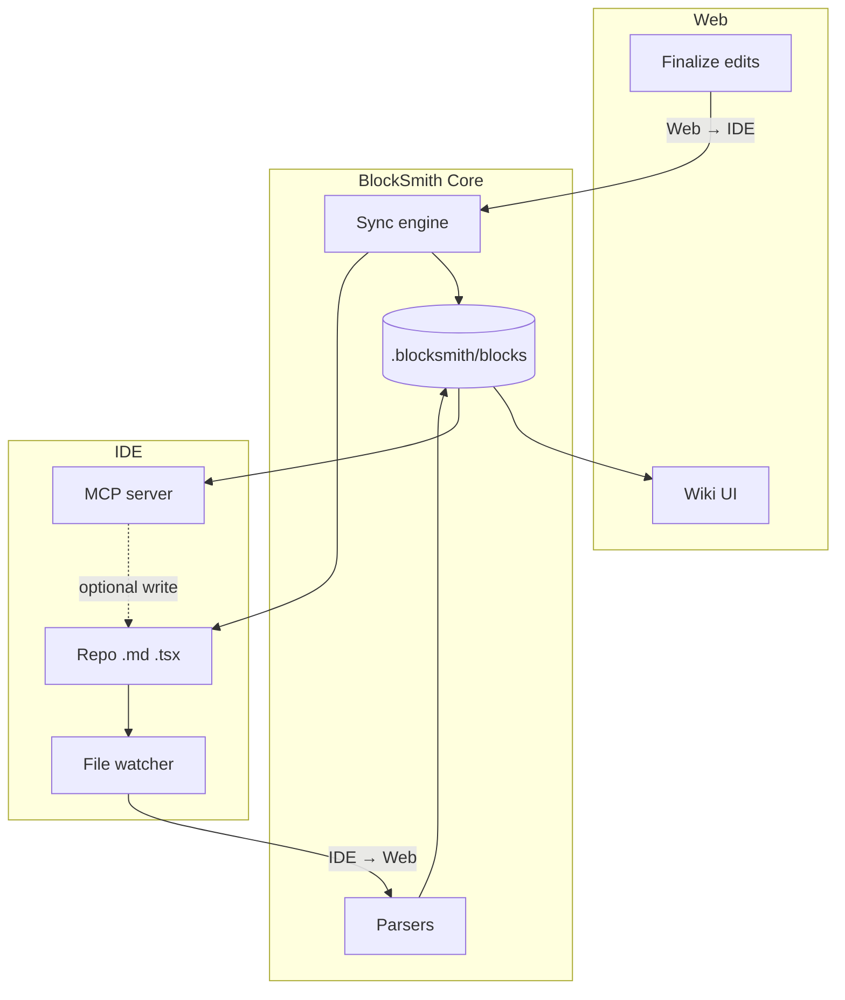

# Architecture

**Handshake:** [08-web-ide-handshake.md](./08-web-ide-handshake.md) — web ↔ IDE, finalized changes on both sides.

---

## System overview

BlockSmith is a **sync engine + block store** between two peers:

| Peer | Technology |
|------|------------|
| **Web** | Wiki app (Next.js) — human KB |
| **IDE** | Repo files + Cursor MCP |



---

## Sync engine (heart of the product)

Responsibilities:

1. **Ingest** repo changes → recompute blocks → notify web
2. **Accept** finalized wiki edits → write repo → notify IDE path via files
3. **Detect** stale / conflict states per block
4. **Expose** `lastSyncAt`, block `status` for UI badges

**Not in scope v1:** cloud sync, multi-user CRDT.

See event table in [08-web-ide-handshake.md](./08-web-ide-handshake.md).

---

## Packages (target monorepo)

```
BlockSmith/
├── apps/
│   └── wiki/                 # Web KB + finalize UI + SSE client
├── packages/
│   ├── core/                 # scan, parse, blocks, sync engine, watch
│   ├── mcp-server/           # IDE-facing tools (same blocks)
│   └── cli/                  # blocksmith dev (wiki + sync + mcp)
├── docs/
└── examples/
```

**Week 1:** Single app; block schema includes `status`, `updatedAt`, `source` for handshake-ready data.

---

## Data flows

### 1. IDE → Web (auto-update)

```
Save DESIGN.md | Button.tsx | tailwind.config.*
        ↓
File watcher (debounced)
        ↓
Targeted parse → merge blocks
        ↓
Write .blocksmith/blocks/*
        ↓
sync.emit('blocks.updated', ids)
        ↓
Wiki SSE/HMR → human sees new content
```

**Human KB stays current with code**—no “regenerate wiki” button for routine changes.

### 2. Web → IDE (finalize)

```
Human edits block in wiki (draft)
        ↓
Click Finalize
        ↓
sync.validate → write DESIGN.md / overrides / linked .md
        ↓
Watcher sees change (ignore echo via content hash)
        ↓
Blocks marked finalized; MCP reads new rules
```

### 3. Paste bootstrap (week 1)

```
Paste CLAUDE.md + DESIGN.md
        ↓
AI structurer → Block[]
        ↓
Wiki renders (session or .blocksmith/)
        ↓
(Optional) Finalize → write repo (week 4+)
```

Same block schema as scan—handshake plugs in without migration.

### 4. MCP (IDE API)

```
Cursor tool call
        ↓
Read blocks from disk (post-sync)
        ↓
Return docs / optionally trigger update_component_docs
        ↓
Same path as IDE → Web if repo files change
```

MCP responses must match wiki pages **byte-for-byte in meaning** (same block IDs).

---

## Block store (Design IR)

```ts
interface Block {
  id: string;
  type: "component" | "token" | "agent-rule" | "workflow" | "page";
  title: string;
  version: number;             // ⬜ promote on Finalize — agent contract
  source: { file: string; line?: number };
  content: { /* props, do/dont, examples, agentHint */ };
  updatedAt: string;
  contentHash: string;       // detect echo / skip loops
  status: "draft" | "finalized" | "stale" | "conflict";
  finalizedAt?: string;
  editedBy?: "web" | "ide" | "mcp";
}
```

- **Location:** `.blocksmith/blocks/<id>.json`, `.blocksmith/index.json`
- **Lock file:** `.blocksmith/blocksmith.lock` — pins `{ blockId → version }` for agents (⬜)
- **Overrides:** `.blocksmith/overrides/*.json` or sections in `DESIGN.md` (pick one in `init`)

### Ingest → IR → compile

```
scan | paste | DESIGN.md  →  blocks.v1 graph  →  wiki | pulse | mcp | lock
```

---

## Wiki app (web peer)

| Route | Purpose |
|-------|---------|
| `/wiki` | KB home |
| `/wiki/[blockId]` | Block view + edit |
| `/paste` | Bootstrap week 1 |
| `/sync` | Status: last sync, stale blocks, conflicts |

**UI requirements for handshake:**

- Badge: Draft / Finalized / Stale
- **Finalize** button on editable blocks
- Toast when IDE changes block: “Button updated from repo”
- Subscribe to sync SSE in `blocksmith dev`

---

## MCP server (IDE peer)

- stdio or SSE alongside wiki in `blocksmith dev`
- Invalidate cache on `blocks.updated`
- Tools: see [03-product-spec-mvp.md](./03-product-spec-mvp.md) + `get_sync_status`

---

## Conflict & loop prevention

| Case | Behavior |
|------|----------|
| IDE saves while user edits draft wiki | Mark block `stale`; offer refresh or merge |
| Finalize writes file watcher fired | `contentHash` unchanged after own write → skip re-parse loop |
| Same block edited both sides | `conflict` until user resolves |

---

## Auto-update example (full handshake)

1. Engineer adds `ghost` to `Button.tsx`, saves (**IDE → Web**).
2. Wiki Button page shows `ghost` within seconds.
3. Design lead adds do/don’t in wiki, clicks **Finalize** (**Web → IDE**).
4. `DESIGN.md` updates; engineer sees diff in IDE.
5. Cursor asks MCP for Button → same do/don’t as wiki.

---

## Tech stack

| Layer | Choice |
|-------|--------|
| Wiki | Next.js + SSE client |
| Sync bus | In-process EventEmitter (dev); optional Redis later |
| Watch | chokidar |
| MCP | `@modelcontextprotocol/sdk` |
| Parse | ts-morph / markdown AST |

---

## Testing handshake

- [ ] IDE: touch `Button.tsx` → wiki assertion within 2s
- [ ] Web: finalize block → `DESIGN.md` contains string
- [ ] MCP `get_component_docs` === wiki render snapshot
- [ ] Conflict UI manual test script in README

---

## Failure modes

| Issue | Mitigation |
|-------|------------|
| Wiki stale | Auto watch; `stale` badge + refresh |
| Finalize overwrites IDE edit | Conflict UI |
| MCP cached | Invalidate on sync events |
| Week 1 no IDE | Paste-only; schema still handshake-ready |
