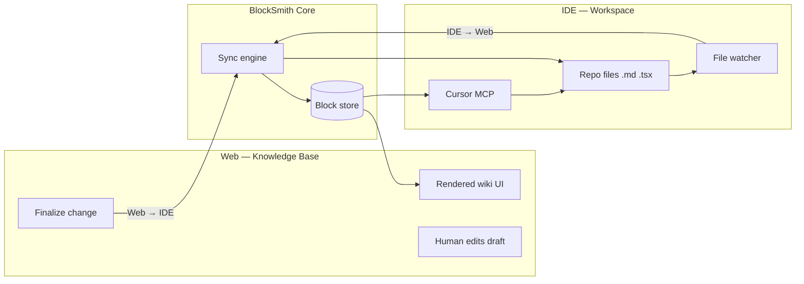

# Web ↔ IDE Handshake


**Product shape:** BlockSmith is an **auto-updating knowledge base** humans use to understand design truth—not a one-time render. The wiki (web) and the workspace (IDE) stay linked: **any change finalized on either side appears on both.**

---

## One sentence

> Connect repo + open wiki. Edit in Cursor or finalize in the browser—same blocks, same docs, always current.

---

## The two surfaces

| Surface | Role | User |
|---------|------|------|
| **Web** (`localhost:3000/wiki`) | Human knowledge base—browse, edit, judge taste, link workflows | Design lead, PM, engineer reviewing rules |
| **IDE** (Cursor + repo) | Implementation—components, tokens, `DESIGN.md`, agent sessions | Engineer, agent |

Neither is “the app” alone. BlockSmith is the **sync layer** between them.

---

## Handshake model



### Direction A — IDE → Web (auto-update)

**Triggers**

- Save on `src/components/**`, `tailwind.config.*`, `DESIGN.md`, `CLAUDE.md`
- `blocksmith scan` / watcher debounced run
- MCP tool `update_component_docs` after agent edits repo

**Effect**

- Parsers refresh affected **blocks**
- Wiki hot-reloads (HMR / SSE)—Button page shows new variant without manual “regenerate”

**Human sees:** Knowledge base always reflects **what is actually in the repo**.

---

### Direction B — Web → IDE (finalize back)

**Triggers**

- Human edits block in wiki (do/don’t, usage copy, workflow link)
- Clicks **Finalize** (or auto-finalize on publish—configurable)

**Effect**

- Sync engine writes canonical updates to repo:
  - `DESIGN.md` / `.blocksmith/overrides/` / per-component `*.blocksmith.md` (policy TBD)
- File watcher sees write → confirms IDE-side files match (no loop if hash unchanged)

**Human sees:** Direction set in the wiki becomes **real files** agents and teammates read in the IDE.

---

## Finalized vs draft

To avoid half-baked rules hitting agents:

| State | Web | IDE / repo |
|-------|-----|------------|
| **Draft** | Editable in wiki; banner “not synced” | Unchanged |
| **Finalized** | Locked badge; shown as canonical | Written to repo; MCP returns new content |
| **Stale** | Wiki behind repo (IDE changed first) | Banner “Refresh” or auto-refresh via watch |
| **Conflict** | Wiki and repo both changed same block | UI shows diff; user picks or merges |

**Rule:** Only **finalized** web edits propagate to IDE. IDE saves propagate to web immediately (code is truth for props/variants); prose rules may require finalize from web.

---

## Governance copilot (Goal 2.5)

Humans steer **when and how** to use a component — not pixels. On workspace-scan component pages:

1. **Prompt** — natural language (*"primary CTA only, max one per view"*).
2. **Draft** — LLM returns `role` + `description` only (scan facts stay read-only).
3. **Preview** — live component + `DESIGN.md` section before finalize.
4. **Finalize** — same draft/finalize/pull loop as Goal 2.

See [GOAL2-GOVERNANCE-COPILOT.md](./GOAL2-GOVERNANCE-COPILOT.md).

---

## Canonical truth (single graph)

```
Repo files  ←──finalize──  Wiki edits
     │                           │
     └────────►  Blocks  ◄────────┘
                    │
              ┌─────┴─────┐
              ▼           ▼
            Web UI       MCP
```

- **Blocks** are the interchange format—not two wikis.
- **Web** renders blocks for humans.
- **IDE** reads/writes repo files; MCP reads blocks (derived from repo + finalized wiki overrides).

---

## Sync events (implementation contract)

| Event | Source | Action |
|-------|--------|--------|
| `repo.file.changed` | IDE watcher | Re-parse → update blocks → push to web |
| `wiki.block.draft` | Web | Local state only |
| `wiki.block.finalized` | Web | Merge block → write repo → emit `repo.file.changed` |
| `mcp.docs.updated` | Cursor tool | Same as scan for targeted paths |
| `sync.conflict` | Core | Surface in web + optional Cursor notification |

**Transport (local dev):**

- File watcher + shared `.blocksmith/` directory
- Wiki dev server subscribes via SSE or WebSocket to `sync` bus
- MCP server reads blocks from disk on each tool call (or subscribes to invalidation)

---

## What users experience

### Engineer in Cursor

1. Adds `ghost` variant to `Button.tsx`, saves.
2. Within seconds, wiki Button page lists `ghost` (IDE → Web).
3. Asks Cursor: “secondary action button?” → MCP returns updated rules.

### Design lead in browser

1. Opens wiki, edits Button do/don’t, clicks **Finalize**.
2. `DESIGN.md` (or override file) updates in repo (Web → IDE).
3. Engineer’s IDE shows file change; agent context on next turn includes new rules.

**Both sides show the same finalized truth.**

---

## MCP in the handshake

MCP is not a separate product—it is the **IDE-facing API** of the same knowledge base. Governance is **built into the connector** (server instructions + prompts + validation tools), so any user who adds BlockSmith in Cursor or Claude gets the governed loop without repo-injected rule files.

| MCP tool | Handshake role |
|----------|----------------|
| `get_component_docs` | Read blocks after sync |
| `get_design_tokens` | Read token blocks |
| `get_governance_rules` | Load palette + do/don't before writing UI |
| `check_component_governance` | Pre-flight a specific component change |
| `validate_ui_code` | Lint generated code before applying |
| `get_component_history` | Shared memory — don’t redo a teammate’s fix |
| `log_component_work` | Record what changed for the team |
| `get_sync_status` | Cursor shows “wiki stale” / last sync time |

---

## Phased delivery

| Phase | Web ↔ IDE | Ship |
|-------|-----------|------|
| **Week 1** | One-way preview: paste → wiki (no live IDE) | Prove human KB UI |
| **Week 2–3** | **IDE → Web** watch + scan | Auto-updating KB from repo |
| **Week 4–5** | **Web → IDE** finalize writeback | True handshake half |
| **Week 6–8** | Conflicts + MCP + `get_sync_status` | Full loop demo |

Week 1 architecture must include: block IDs, `updatedAt`, `source`, `status: draft | finalized | stale` so handshake does not require a rewrite.

---

## Non-goals (handshake v1)

- Real-time multi-user CRDT (single developer machine first)
- Cloud-hosted sync (local `blocksmith dev` only)
- Editing `.tsx` AST from wiki (wiki edits **docs/rules**, scan edits **props** from code)

---

## Acceptance — handshake “done”

- [x] Change `Button.tsx` in IDE → wiki updates without manual refresh (`npm run verify:handshake-acceptance`)
- [x] Finalize component prose in wiki → cloud sidecar + local `DESIGN.md` / `wiki-overrides.json` when path allowed (`npm run verify:handshake-writeback`)
- [x] SaaS pull: `blocksmith pull --doc upload:…` syncs finalized rules to IDE (`npm run verify:handshake-pull`)
- [x] Cursor MCP `get_component_docs` matches wiki Button page content (`verify:handshake-acceptance`)
- [ ] 30s demo recorded — script: [.cursor/handshake-demo.md](../.cursor/handshake-demo.md)

Stale/conflict UX: `npm run verify:sync-conflict` + wiki **Refresh scan** banner on workspace-scan docs.

---

## Related docs

- [04-architecture.md](./04-architecture.md) — pipelines and packages
- [03-product-spec-mvp.md](./03-product-spec-mvp.md) — features per phase
