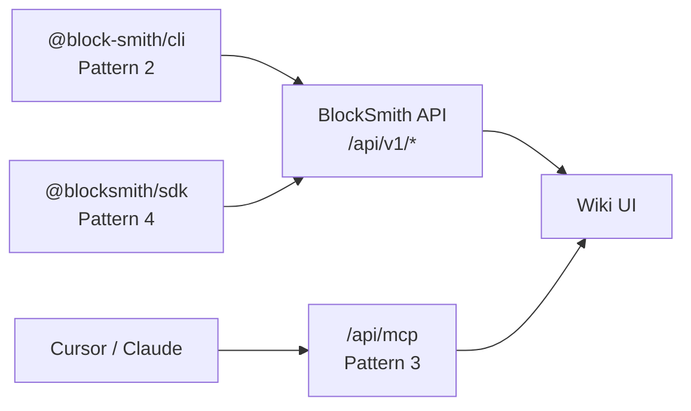

# BlockSmith distribution — Patterns 2, 3, 4

Ship BlockSmith **without open-sourcing the monorepo**. Users install **CLI / SDK** or connect **remote MCP** to your hosted instance.

---

## Architecture



| Pattern | Package / URL | User |
|---------|---------------|------|
| **2 — CLI + cloud** | `@block-smith/cli` | Developer in terminal |
| **3 — Remote MCP** | `https://<host>/api/mcp` | Cursor without cloning repo |
| **4 — SDK** | `@blocksmith/sdk` | Scripts, CI, automations |

All three use the same **API key** (`bs_live_…`).

---

## Persistence — Supabase (free)

Before Vercel deploy, wire Storage so `.md` files survive:

1. Add `SUPABASE_SERVICE_ROLE_KEY` to `.env.local` — see [SUPABASE.md](./SUPABASE.md)
2. Run `supabase/setup.sql` in SQL Editor
3. `npm run verify:supabase`

---

## Server setup (you host BlockSmith)

1. Deploy the Next.js app (Railway, Fly, VPS — needs persistent `data/`).
2. Set env:

```bash
BLOCKSMITH_ADMIN_SECRET=your-long-random-secret   # create API keys
```

3. Create a user API key:

```bash
curl -X POST https://your-host/api/v1/auth/keys \
  -H "Content-Type: application/json" \
  -H "X-BlockSmith-Admin-Secret: $BLOCKSMITH_ADMIN_SECRET" \
  -d '{"label":"friend-beta"}'
```

Save the returned `key` — shown once.

---

## Pattern 2 — CLI

```bash
cd packages/cli && npm run build
npm link   # or publish @block-smith/cli to npm

blocksmith login --key bs_live_... --url https://your-host
blocksmith whoami
blocksmith scan /path/to/vendor-app    # scans locally, uploads markdown to server
blocksmith scan --fixture vendor       # demo scan on server
blocksmith scan --github org/repo      # server shallow-clones public repo
blocksmith codegen --doc upload:scan-acme-ui-kit.md
blocksmith mcp-url
```

Config: `~/.blocksmith/config.json`

---

## Pattern 3 — Remote MCP (Cursor)

Point Cursor at your hosted MCP (Streamable HTTP):

```json
{
  "mcpServers": {
    "blocksmith": {
      "url": "https://your-host/api/mcp",
      "headers": {
        "Authorization": "Bearer bs_live_YOUR_KEY"
      }
    }
  }
}
```

Same tools as local `npm run mcp`: `scan_workspace`, `get_governance_rules`, `validate_ui_code`, etc.

**Note:** `scan_workspace` scans paths **on the server**. For a friend's laptop repo, use CLI scan from their machine (local path) or add GitHub clone (future).

---

## Pattern 4 — SDK

```typescript
import { BlockSmith } from "@blocksmith/sdk";

const bs = new BlockSmith({
  apiKey: process.env.BLOCKSMITH_API_KEY!,
  baseUrl: "https://your-host",
});

const me = await bs.me();
const scan = await bs.createScan({ fixture: "vendor" });
console.log(scan.wikiUrl);
```

Build from monorepo:

```bash
npm run build:packages
```

---

## API reference (v1)

| Method | Path | Auth | Purpose |
|--------|------|------|---------|
| `GET` | `/api/v1/me` | Bearer | Verify key |
| `POST` | `/api/v1/scans` | Bearer | Run scan (`workspace` or `fixture: vendor`) |
| `POST` | `/api/v1/auth/keys` | Admin header | Create API key |
| `GET` | `/api/v1/auth/keys` | Admin header | List key prefixes |
| `POST/GET/DELETE` | `/api/mcp` | Bearer | Remote MCP (Pattern 3) |

### POST /api/v1/scans

```json
{ "workspace": "/abs/path/on/server" }
```

or

```json
{ "fixture": "vendor" }
```

Response includes `wikiUrl`, `docRef`, `fileName`, counts.

---

## Who uses what

| Role | Tool |
|------|------|
| **UI/UX** | Web upload `.md` — no CLI/MCP |
| **Manager** | Wiki link in browser |
| **Developer** | CLI, remote MCP, or local `npm run mcp` |
| **CI** | `@blocksmith/sdk` |

---

## Local dev

```bash
# .env.local
BLOCKSMITH_ADMIN_SECRET=dev-admin-secret

npm run dev
# create key + test
npm run verify:cloud-api
npm run build:packages
```

---

## Publish to npm (when ready)

1. `npm run build:packages`
2. Publish `@blocksmith/sdk` then `@block-smith/cli` (private registry or public).
3. Users never clone BlockSmith — only install packages + your hosted URL.

---

## Related docs

- Goal 1 scan pipeline: [GOAL1-VENDOR-SCAN.md](./GOAL1-VENDOR-SCAN.md)
- MCP tools: [MCP.md](./MCP.md)
- UX upload flow: [PASTE-AND-WIKI.md](./PASTE-AND-WIKI.md)
