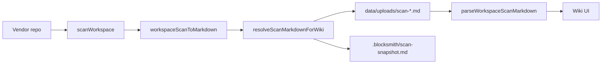

# Goal 1 — Vendor scan E2E


BlockSmith Goal 1 is the **finished-product path for Customer X**: connect a vendor codebase, scan it for design facts, publish a markdown snapshot, and open it in the wiki. No Swagger, no MCP required for this step — npm/scripts or the web UI entry point is enough.

---

## What Customer X does

1. **Home page** — **Connect GitHub** → pick your repo → **Scan → wiki** (OAuth token clones private + public repos you can access).
2. **CLI** — `blocksmith scan /path/to/repo` (scans locally, uploads markdown) or `blocksmith scan --github org/repo`.
3. **Demo** — **Try demo** on home or `blocksmith scan --fixture vendor`.
4. BlockSmith writes `data/uploads/scan-{id}.md` (Supabase when configured) and opens `/wiki?doc=upload:…`.
5. Wiki parses that file as the design system source of truth.
6. **(Phase 2)** Same `.md` compiles to `@blocksmith/<slug>` — see [PHASE2-PULSE.md](./PHASE2-PULSE.md).

**Stable filenames:** explicit `workspaceId` in `blocksmith.config.json` → `scan-acme-ui-kit.md`.  
Repos without config use `package.json` `name` + disambiguator (`github-repo` or path hash) → e.g. `scan-ui-shadcn-ui.md`.

Goals 2–4 (writeback, handshake, stale UX) use MCP and other flows; they are **not** Goal 1.

---

## End-to-end pipeline



| Step | Module | What it does |
|------|--------|--------------|
| 1 | `src/lib/scan/extract.ts` → `scanWorkspace()` | Walk files, extract colors/CSS vars/exports, classify components |
| 2 | `src/lib/scan/to-markdown.ts` → `workspaceScanToMarkdown()` | Serialize facts to markdown + pick stable filename |
| 3 | `src/lib/scan/run.ts` → `scanAndPersist()` | Optional LLM polish, write upload, export vendor snapshot |
| 4 | `src/lib/scan/parse.ts` → `parseWorkspaceScanMarkdown()` | Wiki reads published markdown only |

**Order in `run.ts` matters:** facts are always generated first; LLM curation (when enabled) polishes prose but inventory paths are re-appended so nothing is dropped.

---

## Configuration (limitation fixes)

Vendors control scan behavior with two small JSON files — no BlockSmith code changes.

### `blocksmith.config.json` (repo root)

```json
{
  "workspaceId": "acme-ui-kit",
  "scanPaths": ["src"],
  "catalogPaths": ["src/components/ui"],
  "exportSnapshot": true
}
```

| Field | Purpose |
|-------|---------|
| `workspaceId` | Stable wiki filename: `scan-acme-ui-kit.md` (explicit config only) |
| `scanPaths` | Directories to walk (default: existing `src`, `app`, `components`, …) |
| `catalogPaths` | Extra paths treated as design-system roots for featuring components |
| `exportSnapshot` | When not `false`, writes `.blocksmith/scan-snapshot.md` in the vendor repo |

Loaded by `src/lib/scan/workspace-config.ts` → `loadWorkspaceConfig()`.  
Fallback: `.blocksmith/config.json` with the same shape.  
If no config file: `package.json` `name` (scope stripped) becomes `workspaceId` with a suffix in the filename to avoid collisions.

Env overrides (no config file needed):

- `BLOCKSMITH_SCAN_PATHS` — comma-separated scan roots
- `BLOCKSMITH_CATALOG_PATHS` — comma-separated catalog roots

### `.blocksmith/catalog.json` (classifier overrides)

```json
{
  "forceInventoryOnly": ["src/components/layout/AppShell.tsx"]
}
```

| Field | Effect |
|-------|--------|
| `forceFeatured` | Always publish to Component Library |
| `forceInventoryOnly` | Listed in inventory, never featured |
| `exclude` | Skip file entirely (not inventoried) |

Applied in `src/lib/scan/catalog.ts` → `applyCatalogOverrides()` after the heuristic classifier.

---

## File discovery

`src/lib/scan/walk.ts` → `walkUiFiles()`:

- Walks `resolveScanRoots()` under the workspace
- Skips `node_modules`, `.git`, `.next`, `.blocksmith`, etc.
- Collects `.tsx`, `.jsx`, `.css`, `.scss`, and root `tailwind.config.*`
- Always tries common `globals.css` locations

Design docs: `DESIGN.md`, `design.md`, `DESIGN_SYSTEM.md`, `docs/DESIGN.md` via `findDesignDocPaths()`.

---

## Component classification

`src/lib/scan/catalog.ts` → `classifyComponentForWiki()`:

Heuristics decide whether a `.tsx` file belongs in the wiki **Component Library** (featured) vs inventory-only vs excluded:

- **Featured** (`includeInWiki: true`): design primitives and token showcases under catalog paths (default `src/components/ui`, …)
- **Inventory only**: app chrome, dev tools, rendering infra, pages, unknown paths
- **Overrides** from `.blocksmith/catalog.json` win over heuristics

The demo fixture forces `AppShell` to inventory-only so layout chrome does not appear as a design primitive.

`src/lib/scan/component-filter.ts` → `isScannableDesignComponent()` adds a final gate before pushing to the featured list.

---

## Published markdown

`workspaceScanToMarkdown()` emits YAML frontmatter plus sections:

- Colors, CSS variables, featured components, excluded candidates, full inventory, coverage, design docs

**Filename logic** (`to-markdown.ts`):

- If `workspaceId` is set → `scan-{workspaceId-slug}.md` (stable across machines)
- Else → `scan-{projectName}-{pathHash8}.md` (legacy / ad-hoc paths)

Frontmatter includes `workspace-id` when configured.

---

## Where files land

| Output | Path | Git |
|--------|------|-----|
| Wiki source | `data/uploads/scan-*.md` | Usually gitignored in BlockSmith host |
| Vendor snapshot | `{vendor}/.blocksmith/scan-snapshot.md` | Vendor commits if they want |
| Vendor overrides | `{vendor}/.blocksmith/wiki-overrides.json` | Goal 2 writeback (separate) |

`exportSnapshot` defaults to **on** unless `exportSnapshot: false` in config.

---

## Entry points

### CLI

```bash
npm run scan:vendor          # fixtures/vendor-ui
BLOCKSMITH_WORKSPACE=/path/to/repo npm run scan:vendor
```

### Web API (browser)

`POST /api/scan/workspace` — `src/app/api/scan/workspace/route.ts`

| Body | Auth | Notes |
|------|------|-------|
| `{ "github": "org/repo" }` | GitHub OAuth session | Repo must be in user's GitHub list |
| `{ "fixture": "vendor" }` | None | Try demo |
| `{ "workspace": "…" }` | — | **403** from browser — use CLI `blocksmith scan /path` |

Sets `AI_LAB_SCAN_CURATE=0` by default (facts win for Goal 1).

### Web API (CLI / SDK)

`POST /api/v1/scans` — requires `Authorization: Bearer bs_live_…`

Same scan modes as above plus `clientScan` markdown upload from local `blocksmith scan`.

### Home UI

`src/components/home/ScanWorkspaceCard.tsx` — **Connect GitHub**, repo picker, **Scan → wiki**, **Try demo vendor**. Arbitrary public URL paste is disabled.

---

## Demo fixture

`fixtures/vendor-ui/` — fake Acme UI kit:

- Primitives: `Button`, `Card`, `Badge`, `Input` under `src/components/ui/`
- Layout: `AppShell` (inventory-only via catalog override)
- `DESIGN.md`, `globals.css`, `blocksmith.config.json`

---

## Verification

```bash
npm run verify:goal1           # fixtures + backend (offline)
npm run verify:goal1:full      # + real GitHub repo (needs network)
npm run verify:github-scan     # GitHub clone → persist → wiki parse only
```

| Script | Checks |
|--------|--------|
| `verify-vendor-fixture` | Scan → markdown → parse; stable `scan-acme-ui-kit.md` |
| `verify-vendor-e2e` | Full `scanAndPersist`; upload; wiki parse; snapshot |
| `verify-external-vendor` | Second fixture `fixtures/external-mini` (always) |
| `verify-scan-backend` | Unified service, path guards, clientScan upload |
| `verify-github-scan` | Public repo clone → **scanAndPersist** → upload on disk |

Override GitHub test repo: `BLOCKSMITH_VERIFY_GITHUB=radix-ui/themes npm run verify:github-scan`

---

## Limitations addressed (Goal 1 scope)

| Before | After |
|--------|-------|
| Filename tied to absolute path | `workspaceId` in `blocksmith.config.json` |
| Fixed `src/components/ui` assumption | `scanPaths` + `catalogPaths` in config |
| Heuristic mis-classification | `.blocksmith/catalog.json` overrides |
| Scan doc only in BlockSmith uploads | `.blocksmith/scan-snapshot.md` export in vendor repo |
| Fixture-only CI | `fixtures/external-mini` always verified + optional `BLOCKSMITH_VENDOR_TEST_WORKSPACE` |
| LLM changing facts | `AI_LAB_SCAN_CURATE=0` default for Goal 1 |
| Split scan entry points | **Unified backend** `src/lib/scan/service.ts` |
| Remote scan wrong model | **CLI local scan → `clientScan` upload**; browser uses OAuth `github` field |
| No GitHub OAuth | **Shallow clone** on server via OAuth token; API/CLI may use `GITHUB_TOKEN` env |
| Server scans random paths | **Path guard** — production allows `fixtures/` only |
| GitHub clone abuse | **Rate limit** on `/api/scan/workspace` (8/hour/IP default; API key bypass) |
| Few featured on big repos | **Wiki banner** on intro when featured ≪ inventory |

### Home page scan UI

`ScanWorkspaceCard.tsx` → `POST /api/scan/workspace` with `{ github }` after OAuth.  
Returns `scanMs`, `cloneMs`, `wikiUrl`, `featured`, `reactFiles`. Scans register to the user's **org workspace** (Goal 3).

### Scan backend modes (`POST /api/v1/scans` and `/api/scan/workspace`)

| Mode | Who runs scan | Input |
|------|---------------|-------|
| `clientScan` | Developer machine | `blocksmith scan /path/to/repo` |
| `github` | BlockSmith server | `{ "github": "org/repo" }` |
| `fixture` | BlockSmith server | `{ "fixture": "vendor" }` |
| `workspace` | BlockSmith server | fixtures/ or dev cwd only |

**Still out of scope for Goal 1** (by design): webhooks, Swagger/OpenAPI, Storybook, non-React frameworks, Stripe billing.

**Shipped elsewhere:** GitHub OAuth (home), team RBAC ([GOAL3-TEAM-RBAC.md](./GOAL3-TEAM-RBAC.md)), SaaS ACL ([P2-SHIP-PREP.md](./P2-SHIP-PREP.md)).

---

## Distribution (Patterns 2–4)

Users who **cannot clone BlockSmith** connect via API key:

| Pattern | Tool |
|---------|------|
| CLI | `@block-smith/cli` — `blocksmith scan` |
| SDK | `@blocksmith/sdk` — `createScan()` |
| Remote MCP | `POST/GET /api/mcp` with `Bearer bs_live_…` |

Full setup: **[DISTRIBUTION.md](./DISTRIBUTION.md)**

---

## Key source files

```
src/lib/scan/
  workspace-config.ts   # blocksmith.config.json + catalog.json loaders
  walk.ts               # file discovery
  catalog.ts            # classify + overrides
  extract.ts            # scanWorkspace()
  to-markdown.ts        # facts → .md
  run.ts                # scanAndPersist()
  parse.ts              # .md → wiki system model
  fingerprint.ts        # stale detection (Goal 4)
  types.ts              # WorkspaceScanResult

src/app/api/scan/workspace/route.ts
src/app/api/v1/scans/route.ts
src/app/api/mcp/route.ts
src/lib/cloud/
packages/sdk/
packages/cli/
src/components/home/ScanWorkspaceCard.tsx

fixtures/vendor-ui/
scripts/verify-vendor-fixture.ts
scripts/verify-vendor-e2e.ts
scripts/verify-external-vendor.ts
```

---

## Quick debug checklist

1. **Zero featured components** — add `catalogPaths` in `blocksmith.config.json` or `forceFeatured` in `catalog.json`.
2. **Wrong filename** — set `workspaceId` in config.
3. **Missing inventory paths in wiki** — re-run scan; parse compares full inventory table in markdown.
4. **Stale wiki after vendor edits** — Goal 4 rescan flow (`ScanStaleBanner`, `/api/sync/rescan`), not Goal 1 itself.
