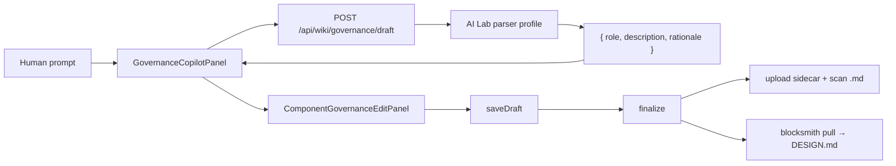

# Goal 2.5 — Governance copilot (Web → IDE steering)

**Product model:** [PITCH-AND-PRODUCT-MODEL.md](./PITCH-AND-PRODUCT-MODEL.md)

**Depends on:** [GOAL1-VENDOR-SCAN.md](./GOAL1-VENDOR-SCAN.md) (scan wiki), Goal 2 finalize + `blocksmith pull` ([08-web-ide-handshake.md](./08-web-ide-handshake.md)).

BlockSmith is **not** a Figma competitor. Humans steer **when and how** components are used; **code** remains visual truth (tokens, variants, paths). The copilot helps design leads and PMs write governance prose in natural language, then finalize into `DESIGN.md`.

---

## What the user does

1. Open a **scanned component page** (e.g. Button from `upload:scan-acme-ui-kit.md`).
2. Describe intent in plain language: *"Primary CTA only on marketing pages; never two per view."*
3. Copilot drafts **Role** + **Usage rules** (do's/don'ts) — constrained to governance fields only.
4. Review **live component preview** + **DESIGN.md preview** + diff vs current rules.
5. **Save draft** → **Finalize** → run `blocksmith pull` in the repo (SaaS) or auto-writeback (local path allowed).

Optional later: attach a **Figma link** as reference — not required for v1.

---

## What the copilot may change

| Field | Copilot | Source of truth |
|-------|---------|-----------------|
| Role (when to use) | ✅ draft | Human finalizes |
| Description (do's/don'ts) | ✅ draft | Human finalizes |
| Tokens, colors, CSS vars | ❌ read-only | Repo scan |
| Source file path, exports | ❌ read-only | Repo scan |
| Component variants / props | ❌ read-only | Repo scan |

The LLM must not invent hex values, token names, or file paths not present in scan context.

---

## Architecture

| Piece | Path |
|-------|------|
| LLM draft | `src/ai-lab/10-governance-copilot/draft.ts` |
| API | `src/app/api/wiki/governance/draft/route.ts` |
| UI | `src/components/wiki/GovernanceCopilotPanel.tsx` |
| Edit + preview | `src/components/wiki/ComponentGovernanceEditPanel.tsx` |
| Finalize / pull | existing Goal 2 stack |

**Env:** `NVIDIA_API_KEY` in `.env.local` (same as scan curation). Without a key, UI shows a clear message — manual edit still works.

---

## Acceptance

- [x] Component page shows copilot on view + edit modes (workspace-scan docs).
- [x] Prompt → draft returns JSON with `role` + `description` only.
- [x] Apply suggestion fills edit fields; preview updates before finalize.
- [x] Finalize + `blocksmith pull` updates `DESIGN.md` with copilot text (`npm run verify:governance-e2e`).
- [x] `npm run verify:governance-copilot` passes when `NVIDIA_API_KEY` is set (skips gracefully otherwise).

---

## Non-goals (v1)

- Editing Figma or generating mockups
- Changing scan facts or re-running scan from chat
- Multi-turn chat memory across sessions
- Auto-finalize without human review

---

## Related

- [01-vision-and-positioning.md](./01-vision-and-positioning.md) — human steering layer
- [08-web-ide-handshake.md](./08-web-ide-handshake.md) — draft/finalize/pull loop
- `Update.md` — changelog entries for Goal 2 / 2.5
